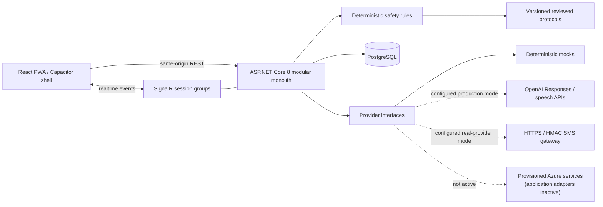
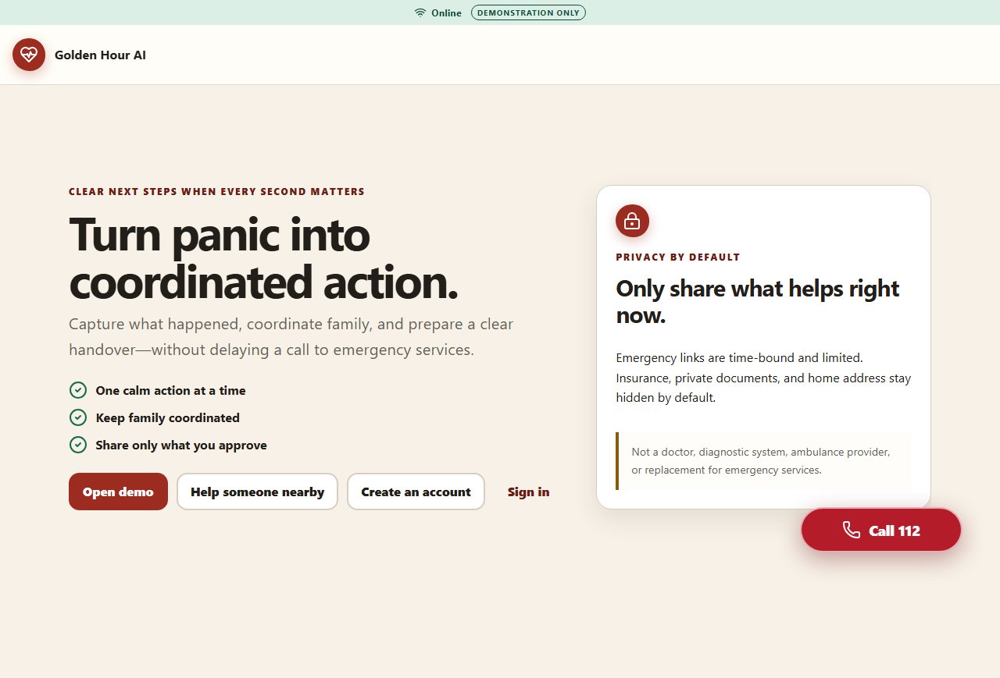
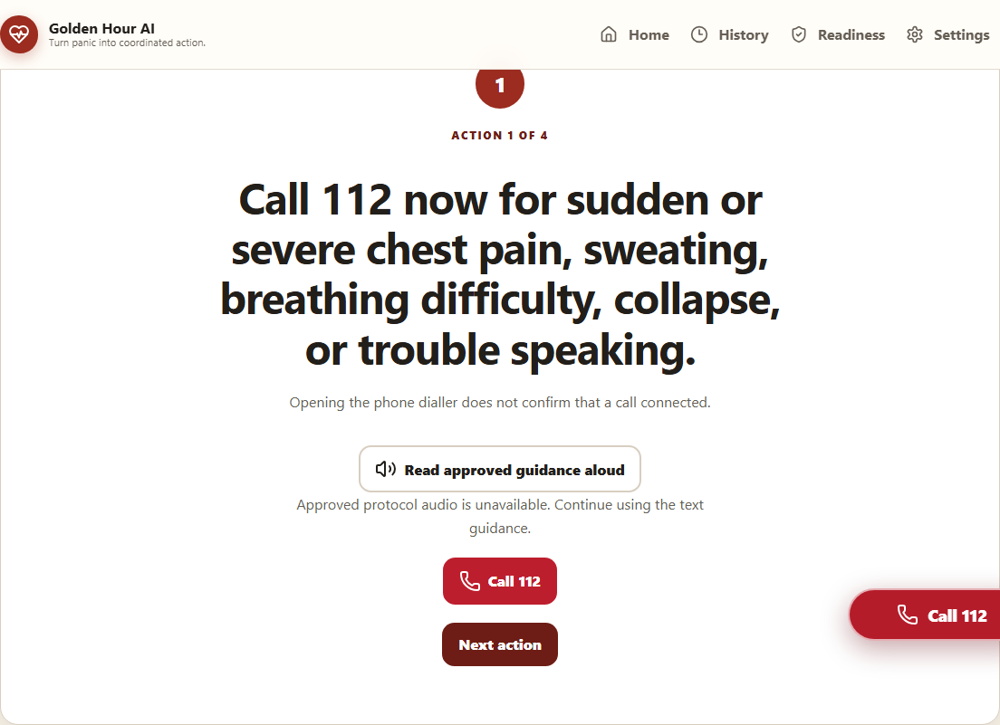

# Golden Hour AI

> **Turn panic into coordinated action.**

Golden Hour AI is an accessible emergency coordination and information-handover prototype. It helps a patient, family member, or bystander capture what happened, keep an emergency-call action immediately available, coordinate practical family tasks, and prepare a clearly sourced responder brief and hospital handover.

> **Safety notice:** Golden Hour AI is not a doctor, diagnostic system, ambulance provider, or replacement for emergency services. It never independently infers or confirms that a call, message, responder, or hospital action succeeded; connected/delivered states require explicit user or provider evidence. In India, use the prominent **Call 112** action for emergency help. Every included protocol is **Demonstration guidance requiring clinical review before production use.**

This repository is a hackathon prototype, not a clinically approved or production-certified medical device.

## Why it exists

Emergencies create an information and coordination problem at exactly the moment people have the least attention to spare. Important facts can be lost, relatives duplicate tasks, and responders receive fragmented handovers. Golden Hour AI keeps the emergency call independent of AI, turns reported facts into a deterministic coordination flow, and preserves provenance and uncertainty throughout the handover.

The key differentiator is the boundary between AI and safety-critical behavior: the active model path extracts incident facts and suggests only task codes; reviewed static protocols, task allowlists, and deterministic server summaries decide what can be displayed. Model translation and model-authored summaries are inactive. AI output cannot contact services, assign privileges, invent clinical instructions, or mark an external action successful.

## Current scope

- Mobile-first React/TypeScript PWA with English and Hindi resources, extensible language support, keyboard operation, reduced-motion behavior, and simple mode.
- ASP.NET Core 8 modular monolith with versioned REST APIs, SignalR, EF Core/PostgreSQL, Identity-based authentication, audit/outbox primitives, and RFC 7807 errors.
- Deterministic mock providers and fictional Jaipur-area demo data for a credential-free demonstration.
- Backend-only OpenAI adapter behind configuration, strict structured extraction, bounded retries/timeouts, and deterministic fallback.
- Configurable outbound HTTPS/HMAC SMS adapter for contact-verification requests; mock mode sends nothing, and accepted/queued never means delivered.
- Multi-stage container build, PostgreSQL Compose environment, Azure Bicep, CI/deployment workflows, and optional Capacitor Android packaging.

Implementation evidence and known gaps are tracked in [the test plan](docs/TEST_PLAN.md) and [implementation plan](docs/IMPLEMENTATION_PLAN.md). No hosted URL, APK, AAB, provider delivery, or test result is claimed unless it was actually produced.

## Architecture



The domain and application layers do not depend on HTTP, EF Core, cloud SDKs, or provider implementations. Durable server state remains authoritative; offline storage is restricted to the app shell, reviewed protocol resources, translations, an opt-in minimal card, and noncritical idempotent updates.

See [Architecture](docs/ARCHITECTURE.md), [AI safety](docs/AI_SAFETY.md), [Security](docs/SECURITY.md), and [API](docs/API.md) for the detailed contracts and diagrams.

## Technology

| Layer | Stack |
| --- | --- |
| Web | React, TypeScript, Vite, React Router, TanStack Query, i18next, SignalR client, Vitest, Testing Library, Playwright |
| API | ASP.NET Core 8, EF Core, PostgreSQL, Identity, JWT/cookie auth, SignalR, FluentValidation, OpenAPI |
| AI | OpenAI Responses API and speech-to-text behind backend interfaces; deterministic mocks by default |
| Delivery | Docker, Docker Compose, Azure Container Apps, PostgreSQL Flexible Server, Bicep, GitHub Actions |
| Mobile | PWA first; optional Capacitor wrapper using package `ai.goldenhour.app` |

## Screenshots

These inspected screenshots contain no account, person, location, token, or user-entered incident data. The second shows only generic reviewed demonstration guidance. Playwright also emits ignored run-specific evidence under `tests/e2e/test-results/`; do not publish those files without reviewing them for entered data. Use the [three-minute demo](docs/DEMO_SCRIPT.md) to reproduce the flow locally.





**Demonstration guidance requiring clinical review before production use.**

## Prerequisites

- [.NET SDK 8](https://dotnet.microsoft.com/download/dotnet/8.0)
- Node.js 22 and npm 10+
- PostgreSQL 16, or Docker Desktop / Docker Engine with Compose v2
- Optional: Azure CLI with the Bicep extension for deployment
- Optional: JDK 21 and Android SDK for Android packaging

## Fastest local start: Docker Compose

From the repository root:

```powershell
Copy-Item .env.example .env
# The copied values are public, local-only demo values. Replace them before any shared use.
docker compose up --build
```

Open `http://localhost:8080`. The container serves the built PWA and API from one origin. PostgreSQL is exposed on `localhost:5432` by default. To stop without deleting the database volume:

```powershell
docker compose down
```

`docker compose down --volumes` permanently removes the local database and should only be used when that data is no longer needed.

## Local development without containers

1. Start PostgreSQL and create the configured database, or use the development in-memory provider.
2. Restore and start the API:

   ```powershell
   dotnet restore GoldenHourAI.sln
   dotnet run --project apps/api/GoldenHour.Api.csproj
   ```

3. In a second terminal, install and start the web client:

   ```powershell
   npm ci --prefix apps/web
   npm run dev --prefix apps/web
   ```

4. Open `http://localhost:5173`. Vite proxies `/api` and `/hubs` to `http://localhost:8080`.

The development settings use the in-memory database and deterministic mock providers unless overridden. To use PostgreSQL, set `Database__UseInMemory=false` and `ConnectionStrings__GoldenHour`, then apply migrations:

```powershell
dotnet tool restore
dotnet ef database update --project apps/api/GoldenHour.Api.csproj --startup-project apps/api/GoldenHour.Api.csproj
```

The repository includes the EF tool manifest and reviewed migrations. Shared deployments use the explicit migration-bundle/job path documented in [Deployment](docs/DEPLOYMENT.md); do not generate or apply an unreviewed production migration at deploy time.

## Configuration

.NET nested settings use double underscores in environment variable names.

| Variable | Required | Purpose |
| --- | --- | --- |
| `ConnectionStrings__GoldenHour` | PostgreSQL mode | Npgsql connection string; treat as a secret |
| `Database__UseInMemory` | No | Development/test-only database switch |
| `Database__MigrateOnStartup` | No | Local/container convenience; keep disabled for concurrent production rollouts unless explicitly controlled |
| `Authentication__Jwt__SigningKey` | Yes outside local development | High-entropy signing key, at least 32 UTF-8 bytes |
| `Authentication__Jwt__Issuer` / `Authentication__Jwt__Audience` | Shared environments | Token issuer/audience that must exactly match validation policy |
| `Authentication__AccessTokenMinutes` / `Authentication__RefreshTokenDays` | No | Short browser credential lifetimes; defaults 10 minutes / 7 days |
| `Seed__DemoPassword` | Development demo only | Seeds `demo@goldenhour.ai` and `family@goldenhour.ai`; never enable demo seeding in production |
| `Providers__UseMocks` | No | `true` uses deterministic local providers |
| `OpenAI__ApiKey` | Real AI mode only | Backend-only OpenAI key; never prefix with `VITE_` |
| `OpenAI__Model` | No | Configured structured-output model; default `gpt-4.1-mini` is a deliberate low-latency extraction choice, not a “latest model” alias |
| `OpenAI__SpeechModel` / `OpenAI__TextToSpeechModel` / `OpenAI__TextToSpeechVoice` | No | Audio models/voice; current defaults are `gpt-4o-mini-transcribe`, `tts-1`, and `alloy` |
| `OpenAI__BaseUrl` / `OpenAI__TimeoutSeconds` | No | Backend provider endpoint and bounded request timeout |
| `SmsGateway__Enabled` | Real provider mode | Must be `true` when mocks are disabled |
| `SmsGateway__Endpoint` | Real provider mode | Approved absolute HTTPS message endpoint |
| `SmsGateway__SigningSecret` | Real provider mode | Backend-only HMAC secret, at least 32 UTF-8 bytes |
| `SmsGateway__TimeoutSeconds` / `SmsGateway__MaximumResponseBytes` | No | Bounded 2–30 second timeout and 1–64 KiB response limit |
| `Webhook__SigningSecret` | Webhooks enabled | Provider callback HMAC secret |
| `Webhook__AllowedClockSkewMinutes` | No | Maximum signed-callback timestamp skew; default 5 minutes |
| `Emergency__DefaultNumber` | No | Country-configurable emergency number; local default is `112` |
| `Emergency__AiConfidenceThreshold` | No | Product uncertainty threshold; not a clinical probability |
| `PublicAppUrl` | Shared environments | Canonical HTTPS origin used for short links |
| `Azure__Storage__ConnectionString` | Reserved | Injected for the provisioned Blob target; application file-storage adapter is currently unavailable |
| `Azure__SignalR__ConnectionString` | Reserved | Injected for the provisioned service; the application still uses in-process SignalR |
| `Azure__ServiceBus__ConnectionString` | Reserved | Injected for the provisioned queue; the application event bus is currently null |
| `APPLICATIONINSIGHTS_CONNECTION_STRING` | Reserved | Provisioned connection; no Application Insights/OpenTelemetry exporter is registered yet |
| `VITE_API_BASE_URL` | Dev only | API origin; production defaults to same origin |
| `VITE_SIGNALR_HUB_URL` | Dev only | Hub URL; production defaults to `/hubs/emergency` |
| `VITE_MOCK_MODE` | No | Full client-only deterministic demo/data bypass; not a general failure-fixture switch or authorization boundary |
| `VITE_EMERGENCY_NUMBER` | No | Display/call fallback; server configuration remains authoritative |

The complete local template is [.env.example](.env.example). Production secrets belong in GitHub environment secrets and Azure secret stores, never source control or `VITE_*` values.

## Demo accounts and mock scenario

Development seeding creates fictional accounts only when a nonempty `Seed__DemoPassword` is supplied:

- `demo@goldenhour.ai`
- `family@goldenhour.ai`

For the documented local demo, copy `.env.example` and use its intentionally public local-only password `GoldenHour-Demo-Only-2026!` for both accounts. You may change `DEMO_PASSWORD`, but the replacement must satisfy the configured Identity policy. The same fallback appears in the checked-in ASP.NET Development settings; it must not be used in any shared environment.

The stable scenario uses fictional patient Raj Kumar and the Hindi report:

> मेरे पिताजी को अचानक सीने में दर्द और बहुत पसीना आ रहा है। उन्हें बोलने में भी परेशानी हो रही है।

Mock mode should preserve the original text, extract bounded facts, show uncertainty, select the versioned chest-pain demonstration protocol, and keep the call action visible. Follow [docs/DEMO_SCRIPT.md](docs/DEMO_SCRIPT.md) rather than improvising clinical claims.

## OpenAI mode

Mock mode is the default and is the recommended deterministic hackathon path. To exercise the real backend provider locally:

```powershell
$env:Providers__UseMocks='false'
$env:OpenAI__ApiKey='<set-in-your-shell-or-secret-store>'
$env:OpenAI__Model='gpt-4.1-mini'
$env:SmsGateway__Enabled='true'
$env:SmsGateway__Endpoint='https://approved-sms-gateway.example/messages'
$env:SmsGateway__SigningSecret='<set-a-32-byte-or-longer-secret-in-your-shell>'
dotnet run --project apps/api/GoldenHour.Api.csproj
```

Disabling mocks currently enables OpenAI/speech and requires the SMS gateway configuration together; this prevents a partial real-provider deployment from silently using fake messaging. Do not put either secret in `.env.example`, browser code, logs, screenshots, or issue reports. Real AI output still passes strict schema validation, forbidden-content filtering, deterministic protocol selection, and the same static fallback. Provider configuration never turns AI text into a privileged command.

## Build and test

```powershell
# Backend build and tests
dotnet build GoldenHourAI.sln --configuration Release
dotnet test GoldenHourAI.sln --configuration Release --collect:"XPlat Code Coverage"

# Frontend quality gates and production PWA
npm ci --prefix apps/web
npm run lint --prefix apps/web
npm run typecheck --prefix apps/web
npm test --prefix apps/web -- --run
npm run build --prefix apps/web

# End-to-end, after its package install and browsers are available
npm ci --prefix tests/e2e
npm exec --prefix tests/e2e -- playwright install --with-deps chromium
npm run test:e2e --prefix tests/e2e
```

The PWA build output is `apps/web/dist/`. Coverage and test reports are generated locally and are not evidence of a passing run unless the commands complete successfully. See [Test plan](docs/TEST_PLAN.md) for the required positive, negative, accessibility, offline, and security evidence.

## Azure deployment

The Azure target is one Container App that serves the PWA and API from the same origin, plus PostgreSQL Flexible Server, Blob Storage, Service Bus, Azure SignalR, Application Insights/Log Analytics, ACR, and a Key Vault boundary. No Azure resources or public URL are included in this repository.

After Azure CLI login and secret setup:

```powershell
az login
az account set --subscription '<subscription-id>'
./infrastructure/scripts/deploy.ps1 `
  -SubscriptionId '<subscription-id>' `
  -ResourceGroup 'rg-goldenhour-dev' `
  -Location 'centralindia' `
  -EnvironmentName 'dev' `
  -PostgresAdminPassword (Read-Host 'PostgreSQL password' -AsSecureString) `
  -JwtSigningKey (Read-Host 'JWT signing key' -AsSecureString) `
  -WebhookSigningSecret (Read-Host 'Webhook signing secret' -AsSecureString)
```

The script performs a Bicep validation/deployment, builds the image in ACR, runs migration as an explicit observed phase, updates the Container App, and invokes health/smoke checks. Rollback is a separate, auditable operation. Read [Deployment](docs/DEPLOYMENT.md) before using shared infrastructure.

## Android packaging

The web URL/PWA is the primary deliverable. Capacitor uses application ID `ai.goldenhour.app` and reads `apps/web/dist`. The current wrapper is packaging infrastructure only: its local `https://localhost` origin is not yet wired to a deployed API/auth topology, so an APK built from this tree must not be described as a functional production client without that design and device testing.

Local debug build, when JDK 21 and an Android SDK are installed:

```powershell
npm ci --prefix apps/web
npm run build --prefix apps/web
Push-Location apps/web
npx cap add android    # first generation only
npx cap sync android
./android/gradlew.bat -p android assembleDebug
Pop-Location
```

The debug APK is produced by Gradle under `apps/web/android/app/build/outputs/apk/debug/` only after a successful build. The `android-debug.yml` workflow uploads it as a workflow artifact; this README does not claim that artifact exists.

Release AAB builds require the repository owner to supply an Android keystore and signing secrets. No keystore is committed. See [android/README.md](android/README.md) and the `android-release.yml` workflow for the exact secrets and Play Console internal-testing steps.

## Privacy and security

- Treat profile data, emergency text/audio, locations, tokens, and summaries as sensitive.
- Browser authentication uses Secure, HttpOnly, SameSite cookies; tokens are not stored in local storage.
- Bystander links expose a server-side allowlisted projection through short-lived, hashed, revocable, rate-limited tokens.
- Private documents and provider payloads are excluded from PWA caches, analytics, logs, and test snapshots.
- AI prompts and untrusted uploads cannot invoke privileged operations.
- Deployment secrets are supplied at deploy time and redacted from command output.

This prototype still requires a jurisdiction-specific privacy, retention, threat-model, penetration-test, accessibility, and clinical review before real-world use. Report security issues privately to the repository owner; do not include sensitive data in a public issue.

## Documentation

- [Product requirements](docs/PRODUCT_REQUIREMENTS.md)
- [Architecture](docs/ARCHITECTURE.md)
- [AI safety](docs/AI_SAFETY.md)
- [Security](docs/SECURITY.md)
- [API](docs/API.md)
- [Test plan](docs/TEST_PLAN.md)
- [Three-minute demo](docs/DEMO_SCRIPT.md)
- [Deployment and rollback](docs/DEPLOYMENT.md)
- [Implementation plan and traceability](docs/IMPLEMENTATION_PLAN.md)

## Known prototype limitations

- No public Azure URL, external-provider delivery, APK, AAB, or Play release has been produced by the repository alone.
- Protocol content is demonstration-only and has not received the independent clinical/localization review required for real use.
- Azure Bicep still requires subscription-side validation, regional SKU/quota review, cost approval, a real deployment rehearsal, backup/restore proof, and security/accessibility testing against the deployed revision.
- The HMAC SMS request adapter is implemented, but no external gateway delivery has been exercised or certified. `accepted`/`queued` is not delivery.
- Application Insights, Azure SignalR, Service Bus, Blob, file-storage, email/general-notification, and production map adapters are inactive even where Bicep provisions resources or injects connection strings.
- The Capacitor wrapper has no verified remote API/cookie-auth topology; Android workflows prove packaging only when they run, not end-to-end mobile functionality.
- The current production build emits one 638.90 kB JavaScript chunk (183.62 kB gzip); route/vendor splitting and an enforced performance budget remain release optimization work.
- Final local test, coverage, Docker, screenshot, and tooling results belong in [the verification log](docs/TEST_PLAN.md). Hosted deployment, provider delivery, and Android artifacts remain unclaimed until actually produced.

## Roadmap

1. Independent clinical review and signed, country-specific protocol publishing.
2. Privacy impact assessment, retention/deletion policy, penetration testing, and formal accessibility audit.
3. Real provider certification with delivery reconciliation and operational runbooks.
4. Regional disaster recovery, encrypted backup/restore exercises, and audited key rotation.
5. Carefully evaluated additional languages, speech models, low-bandwidth behavior, and device coverage.
6. Store-distributed Android/iOS shells only after the PWA, privacy disclosures, permission prompts, and signing process pass review.

## License

Code is available under the [MIT License](LICENSE). The license does not grant clinical approval, medical-device certification, or permission to use third-party medical content.
