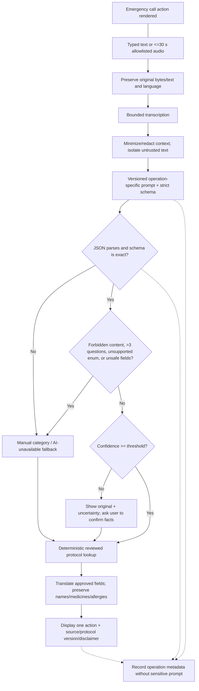

# AI safety

## Safety position

Golden Hour AI uses a language model as an uncertain extractor, translator, and summarizer. It is not a clinician, dispatcher, or source of emergency actions. The configured emergency-call action is available before and throughout AI work. Only deterministic backend rules and versioned files in `apps/api/Protocols` can select an action shown as protocol guidance.

All prototype content is labeled: **Demonstration guidance requiring clinical review before production use.**

## Allowed and prohibited responsibilities

| AI may | AI must never |
| --- | --- |
| Detect likely input language with confidence | Diagnose or state that a diagnosis is likely/certain |
| Preserve and normalize reported facts | Invent an observation, medication, dosage, treatment plan, or clinical claim |
| Extract the strict incident contract | Mark a call/message/notification/responder as successful |
| Identify missing factual questions, maximum three | Delay, obscure, or gate the emergency-call action |
| Suggest IDs from an allowlisted coordination-task catalogue | Assign permissions, call providers, write arbitrary state, or execute model text |
| Translate already approved content while preserving names | Present generated text as reviewed clinical guidance |
| Draft family/responder/hospital summaries with provenance | Hide uncertainty, transform unknown into no, or merge confirmed/unconfirmed facts |

## Panic-to-protocol pipeline



No branch waits indefinitely. Timeout, refusal, rate limit, provider outage, unexpected content type, parse failure, schema failure, or policy failure terminates the model path and selects the manual/static path.

## Extraction contract

The model candidate must contain exactly the agreed fields and enums:

```json
{
  "detectedLanguage": "string",
  "languageConfidence": 0.0,
  "incidentCategory": "string",
  "patientRelationship": "self|family|bystander|unknown",
  "observations": ["string"],
  "reportedSymptomStartTime": "string|null",
  "isConscious": "yes|no|unknown",
  "isBreathingNormally": "yes|no|unknown",
  "isHeavyBleedingReported": "yes|no|unknown",
  "locationDescription": "string|null",
  "urgencyClassification": "emergency|urgent|unknown",
  "criticalMissingQuestions": [
    {
      "id": "string",
      "question": "string",
      "answerType": "yes_no|single_choice|time|text"
    }
  ],
  "handoverFacts": ["string"],
  "uncertainties": ["string"],
  "confidence": 0.0
}
```

Validation requirements:

- Reject additional/missing properties, non-finite or out-of-range confidence, unsupported categories/enums, overlong values/arrays, control characters, and more than three questions.
- Treat empty, contradictory, or ambiguous states as unknown/uncertain; never coerce unknown to no.
- Run forbidden-content checks over every model string, not just summary fields.
- Do not display a model-provided action. Map the validated category/facts to an internal protocol ID and load its actions from the repository.
- Map suggested task IDs through the backend catalogue and authorization/state rules; ignore model-supplied labels or commands.
- Verify any translated structure against the source IDs and immutable medical/proper-noun spans.

## Prompt and tool boundaries

Each operation has a small, versioned prompt: incident extraction, translation, responder summary, hospital handover, and coordination-task suggestion. User input and uploaded text are delimited as untrusted data and cannot override system policy, request secrets, choose tools, or provide executable instructions.

The provider receives only the minimum fields required for that operation. Documents, profile fields, and previous messages are excluded unless explicitly needed and allowed. Model tool requests, if ever enabled, go through an allowlisted dispatcher that re-validates the authenticated user, resource, operation, arguments, idempotency key, and current state. The model never holds credentials and never calls notification, sharing, token, or session-state operations directly.

## Confidence and confirmation

The configured threshold is a product safety signal, not a medical probability. Below threshold—or when language confidence is insufficient—the UI:

1. Keeps the emergency-call action present.
2. Shows the original transcript.
3. Labels the interpretation uncertain.
4. Presents extracted facts for confirmation/correction.
5. Asks no more than three critical factual questions.
6. Uses the manually selected category and reviewed static protocol in parallel.

The UI never presents a confidence number as certainty, severity, survival probability, or clinical accuracy.

## Provider resilience

| Failure | Safe behavior | Required evidence |
| --- | --- | --- |
| API key absent / mock mode | Deterministic mock extraction or manual category; visible mock indicator where appropriate | Mock scenario contract tests |
| Timeout / network / 429 | Bounded retry with jitter only for safe idempotent provider call; then static fallback | Clock-controlled timeout/rate-limit tests |
| Refusal | Preserve original, record refusal metadata, static fallback | Provider refusal test |
| Malformed JSON / unsupported enum | Reject the entire candidate; never partially apply | Strict contract tests |
| Diagnosis, dosage, treatment, success claim | Policy rejection and static fallback; no unsafe string reaches protocol UI | Adversarial output tests |
| Prompt injection | Treat as an observation string or reject; no tool/state/secret effect | User and document injection tests |
| Translation failure | Display approved source/English fallback and language notice | Translation failure tests |
| Speech failure / low-confidence language | Fall back to editable text/language chooser | Audio/language tests |

Retries never duplicate an emergency session, timeline event, external provider operation, or task mutation.

## Provenance in summaries

Every handover fact carries a source class and confirmation state:

- Original user report.
- Self-reported emergency profile snapshot.
- AI-extracted candidate.
- User/bystander-confirmed observation.
- Reported family action.
- Provider-confirmed delivery.
- Unknown or missing.

Summaries must not merge these classes into a fluent narrative that implies verification. The original description, language, protocol ID/version, AI model/operation metadata, confidence, uncertainty, and missing fields remain visible to authorized users.

## Logging and audit

Record operation type, prompt/template version, configured model, outcome class, latency, retry count, and token usage when the provider supplies it. Do not log input text/audio, model output, profile values, bystander/share tokens, authorization cookies, raw provider payloads, or secret-bearing headers. Use opaque operation/session IDs and correlation IDs.

Audit policy decisions such as fallback, forbidden-output rejection, fact confirmation, protocol selection, and privileged state transitions without duplicating sensitive values. Telemetry sampling and exporter configuration must preserve these exclusions.

## Safety evaluation set

The deterministic evaluation suite includes:

- Hindi chest-pain demo and mixed Hindi/English names/medicines.
- Low confidence, unsupported language, ambiguous consciousness/breathing, and contradictory reports.
- Provider timeout, rate limit, refusal, malformed JSON, missing/additional fields, unsupported enum, excessive questions, and overlong values.
- Model-generated diagnosis, dosage, treatment plan, unsupported clinical claim, and false call/provider success.
- Prompt injection in direct text and uploaded-document text, including attempts to reveal secrets or invoke operations.
- Translation that changes a medicine/allergy/proper noun or alters protocol action IDs.

Tests assert both the absence of prohibited content/effects and the presence of a bounded call/static-fallback path. Passing a small evaluation set is not clinical validation.

## Change control

Prompt, schema, threshold, protocol, model, policy, and translation changes are safety-relevant. A change must include:

1. A versioned diff and named owner.
2. Positive, negative, adversarial, multilingual, accessibility, and fallback regression results.
3. Review that protocols remain repository-authored and visibly labeled.
4. Privacy review of any newly transmitted field.
5. Rollback target and compatibility assessment for active sessions.

Before production, obtain independent clinical review of every protocol and locale, formalize model evaluation thresholds, monitor drift/refusals/fallbacks without collecting sensitive prompts, and establish a safety incident response process.
