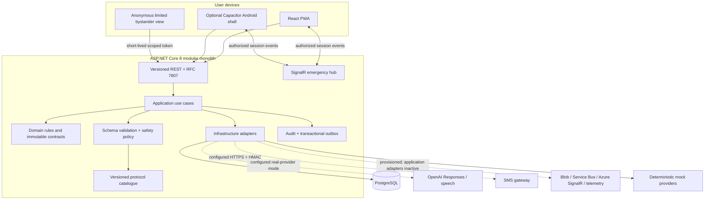
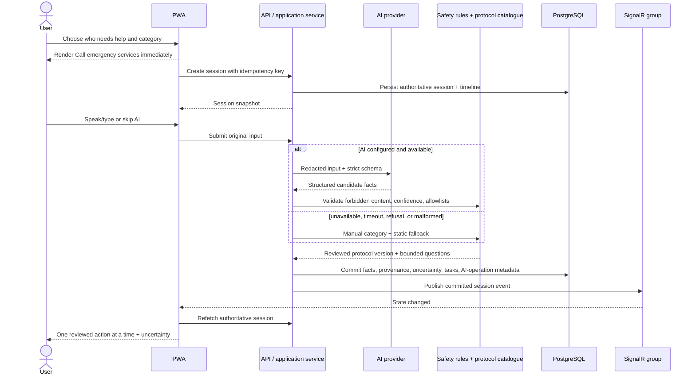
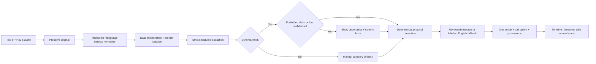
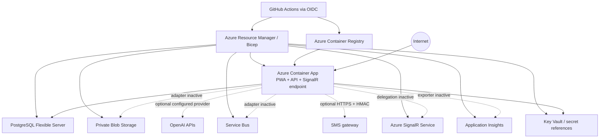

# Architecture

## Purpose and constraints

Golden Hour AI is a modular monolith optimized for a short, coherent emergency demo and a single-origin deployment. The architecture prioritizes an always-available emergency call action, deterministic safety rules, authoritative server state, least-privilege sharing, accessible degraded behavior, and replaceable external providers.

The system is not a medical decision-maker. Reviewed files in `apps/api/Protocols` are the only source of protocol actions. Every prototype protocol must display **Demonstration guidance requiring clinical review before production use.**

## System context



## Module boundaries

| Boundary | Owns | Must not own |
| --- | --- | --- |
| Domain | Entity invariants, task/state transitions, readiness rules, allowlists, protocol selection contracts | HTTP, EF Core, cloud/OpenAI SDKs, UI concerns |
| Application | Use-case orchestration, interfaces, validation sequencing, authorization requirements, idempotency | Provider implementation details or browser rendering |
| Infrastructure | EF Core, Identity persistence, AI/messaging/storage adapters, clock, outbox delivery, telemetry | New clinical actions or authorization policy decisions |
| API | Versioned endpoints, cookies/authentication, rate limits, Problem Details, correlation IDs, SignalR transport | Medical decision logic or direct model-to-operation execution |
| Web | Accessible interaction, offline shell/card, local display state, reconnect/polling | Clinical decision rules, durable authority, tokens in local storage |

Dependencies point inward: API and Infrastructure depend on Application/Domain contracts, never the reverse.

## Emergency-session flow



AI is never on the path to rendering or activating the `tel:` emergency-call action. A call is recorded as initiated or connected only after explicit user confirmation; message delivery is recorded only from provider confirmation.

## AI safety pipeline



Details, prohibited output, and evaluation cases are in [AI_SAFETY.md](AI_SAFETY.md).

## Realtime communication

```mermaid
sequenceDiagram
    participant A as Owner browser
    participant API as REST API
    participant Hub as SignalR hub
    participant B as Family browser

    A->>API: Mutating command + idempotency key
    API->>API: Authorize resource and commit transaction
    API->>Hub: Publish event to session group
    Hub-->>A: Lightweight change notification
    Hub-->>B: Lightweight change notification
    A->>API: Fetch authoritative snapshot
    B->>API: Fetch authoritative snapshot
    Note over A,B: Timeline IDs/version prevent duplicates
    B--xHub: Network interruption
    B->>B: Show disconnected status; poll REST
    B->>Hub: Reconnect and re-authenticate
    Hub->>Hub: Rejoin authorized session group
    B->>API: Fetch current authoritative snapshot
```

Hub group names and membership are server-controlled. A client cannot enumerate or join a session solely by guessing its ID. SignalR is an optimization for freshness, not the durable event store.

## Offline and degraded state

- Cache: hashed static application assets, translation resources, reviewed public protocol content, and an opt-in minimal emergency card.
- Never cache: access/refresh tokens, private documents, raw audio, complete medical records, provider payloads, or authenticated API responses.
- Queue: only noncritical, explicitly allowlisted timeline commands with a stable client idempotency key.
- Never queue/retry: emergency calls, token operations, invitations, sharing changes, or external notifications.
- On reconnect: submit each queued command once, accept idempotent server replay, then replace local state from the server snapshot.
- AI failure selects a manual category/static protocol; SignalR failure polls REST; location denial enables typed location; microphone denial enables text.

## Data model

The following diagram is conceptual; migrations are the executable schema authority.

```mermaid
erDiagram
    APPLICATION_USER ||--o| EMERGENCY_PROFILE : owns
    EMERGENCY_PROFILE ||--o{ EMERGENCY_CONTACT : has
    EMERGENCY_PROFILE ||--o{ ALLERGY : reports
    EMERGENCY_PROFILE ||--o{ MEDICAL_CONDITION : reports
    EMERGENCY_PROFILE ||--o{ MEDICATION : reports
    EMERGENCY_PROFILE ||--o{ MEDICAL_PROCEDURE : reports
    EMERGENCY_PROFILE ||--o| PREFERRED_HOSPITAL : selects
    EMERGENCY_PROFILE ||--o| SHARING_PREFERENCE : controls
    APPLICATION_USER ||--o{ EMERGENCY_SESSION : owns
    EMERGENCY_SESSION ||--o{ EMERGENCY_PARTICIPANT : includes
    EMERGENCY_SESSION ||--o{ EMERGENCY_OBSERVATION : records
    EMERGENCY_SESSION ||--o{ EMERGENCY_TASK : coordinates
    EMERGENCY_SESSION ||--o{ EMERGENCY_TIMELINE_EVENT : orders
    EMERGENCY_SESSION ||--o{ EMERGENCY_LOCATION : tracks
    EMERGENCY_SESSION ||--o{ EMERGENCY_SUMMARY : produces
    EMERGENCY_SESSION ||--o{ EMERGENCY_SHARE_TOKEN : scopes
    APPLICATION_USER ||--o{ REFRESH_TOKEN : rotates
    EMERGENCY_SESSION ||--o{ AI_OPERATION : audits
```



`NOTIFICATION_DELIVERY`, `AUDIT_EVENT`, and `OUTBOX_MESSAGE` are intentionally omitted from session relationship edges: their current schema uses provider/message keys or generic resource/payload metadata rather than an `EmergencySession` foreign key. Important storage properties include UTC timestamps, optimistic concurrency, explicit provenance, indexes on session/token hash/status/time, a unique idempotency constraint for critical commands, hashed refresh/share tokens, and minimal provider payload retention.

## Production deployment



The first deployment intentionally uses one HTTPS origin for the PWA, API, cookies, and hub. PostgreSQL is active. OpenAI/speech and the HMAC SMS gateway are configurable application adapters. Blob Storage, Service Bus, Azure SignalR, and the Application Insights exporter are provisioned targets but remain inactive in application code. Bicep definitions and the migration/health/smoke/rollback sequence are documented in [DEPLOYMENT.md](DEPLOYMENT.md).

## Key architectural decisions

1. **Modular monolith first:** one transactional boundary and one deployable reduce emergency-session consistency and hackathon operational risk.
2. **Static protocol authority:** AI can select or simplify only versioned, reviewed content; clinical actions never originate in a prompt response.
3. **Server-authoritative realtime:** commit first, notify second, refetch on reconnect. This makes duplicate and out-of-order client messages recoverable.
4. **Same-origin browser security:** the API serves the production PWA so Secure/HttpOnly cookies and SignalR do not require a cross-origin token design.
5. **Mock-first integrations:** a deterministic demo works without external keys. Real-provider mode currently couples OpenAI/speech with the bounded HMAC SMS adapter. Database readiness is implemented; provider-specific health/delivery evidence is still required before claiming either external integration operational.
6. **PWA before native:** the installable web experience is primary. Capacitor adds packaging, not a separate clinical or state implementation.

## Scalability and recovery limits

The checked-in deployment is deliberately restricted to one API replica because SignalR remains in-process and the event bus/file-storage/cloud telemetry adapters are inactive. Durable state is committed before realtime notification; only selected external events currently receive outbox records, and the dispatcher has no distributed lease. It can scale replicas only after SignalR is delegated to Azure SignalR, a real event bus and idempotent outbox consumers/distributed leasing are implemented, and shared state remains in PostgreSQL. Production readiness still requires measured load limits, database point-in-time restore exercises, multi-region requirements, retention rules, alert thresholds, queue poison-message handling, and a documented recovery-time/recovery-point objective. None is claimed by the checked-in prototype alone.
