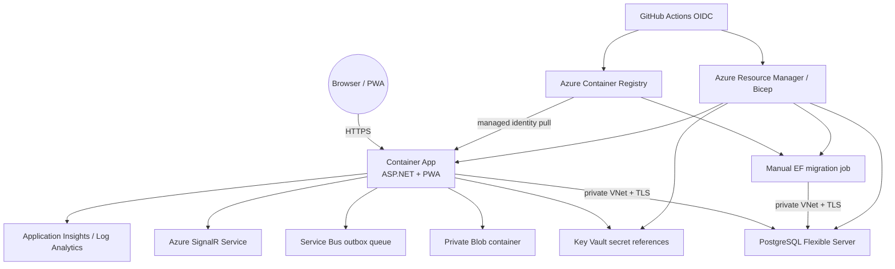

# Deployment and rollback

## Deployment contract

The first Azure topology serves the built React PWA and ASP.NET Core API from one Azure Container App and one HTTPS origin. This simplifies Secure/HttpOnly browser cookies, SignalR, CSP, and routing. PostgreSQL is privately reachable from the Container Apps environment. External provider resources are provisioned but used only when the corresponding application adapter/configuration is enabled and healthy.

No Azure subscription, hosted URL, provider delivery, APK, or AAB is included or claimed by this repository.



## Files and responsibilities

| Path | Responsibility |
| --- | --- |
| `Dockerfile` | Node 22 PWA build, .NET 8 publish, EF migration bundle, non-root ASP.NET runtime |
| `docker-compose.yml` | Local PostgreSQL 16 plus same-origin application in deterministic mock mode |
| `infrastructure/bicep/main.bicep` | Azure VNet/DNS, ACR, identity/RBAC, PostgreSQL, Storage, Service Bus, SignalR, telemetry, Key Vault, Container App and migration job |
| `infrastructure/bicep/main.parameters.example.json` | Non-runnable naming/SKU example; secure placeholders must be overridden |
| `infrastructure/scripts/deploy.ps1` | Validate/deploy Bicep, ACR build, migration, revision promotion, health and smoke |
| `infrastructure/scripts/migrate.ps1` | Start one Container Apps EF bundle job and wait for an observed terminal state |
| `infrastructure/scripts/health-check.ps1` | Poll process liveness and dependency readiness |
| `infrastructure/scripts/smoke-test.ps1` | Verify health plus same-origin PWA shell/manifest; does not assert providers/clinical behavior |
| `infrastructure/scripts/rollback.ps1` | Preflight a prior revision, shift traffic, verify, and restore previous traffic if checks fail |
| `.github/workflows/ci.yml` | Build/test/coverage/PWA/E2E/container/Bicep gates |
| `.github/workflows/deploy-azure.yml` | Manual protected-environment OIDC deployment after reusable CI gates |

## Local container environment

Copy and edit the development-only environment file:

```powershell
Copy-Item .env.example .env
docker compose config --quiet
docker compose up --build --detach --wait
./infrastructure/scripts/health-check.ps1 -BaseUrl http://localhost:8080
./infrastructure/scripts/smoke-test.ps1 -BaseUrl http://localhost:8080
```

The Compose API overrides `Database__UseInMemory=false`, uses the PostgreSQL service, enables controlled startup migration for a single local application container, and uses deterministic mock providers. It binds the app to `http://localhost:8080`; do not expose this development configuration to a network.

Inspect status without printing environment variables:

```powershell
docker compose ps
docker compose logs --no-color --tail 200 app
```

Stop while keeping the database:

```powershell
docker compose down
```

Only when the local database is disposable:

```powershell
docker compose down --volumes
```

## Container build

```powershell
docker build --tag golden-hour-ai:local .
docker image inspect golden-hour-ai:local
```

The final image includes:

- `GoldenHour.Api.dll` and backend content.
- `wwwroot/` from `apps/web/dist` for one-origin hosting.
- `/app/efbundle`, generated from checked-in EF migrations for the same release.
- Alpine ASP.NET runtime plus `curl` for container liveness.

The API runs as the .NET image's non-root `$APP_UID` on port `8080`. The Docker health check calls `/health/live`; orchestration readiness must call `/health/ready`. An image build fails if locked npm install, PWA build, .NET restore/publish, or migration-bundle generation fails.

## Azure prerequisites

1. An Azure subscription with permission to create the listed resources, role assignments, a resource group, and federated deployment identity.
2. Azure CLI current enough to provide GA `az containerapp` and Container Apps job commands; Bicep CLI through `az bicep`.
3. Resource providers registered for `Microsoft.App`, `Microsoft.ContainerRegistry`, `Microsoft.DBforPostgreSQL`, `Microsoft.Insights`, `Microsoft.KeyVault`, `Microsoft.ManagedIdentity`, `Microsoft.Network`, `Microsoft.OperationalInsights`, `Microsoft.ServiceBus`, `Microsoft.SignalRService`, and `Microsoft.Storage`.
4. A region with capacity for PostgreSQL Flexible Server, Container Apps VNet integration, SignalR, and chosen SKUs. The example uses `centralindia`; availability and quota must be verified in the owner's subscription.
5. Budget/alerts and an owner/cost-center tag. The Bicep template creates billable resources; delete disposable resource groups after use.
6. High-entropy, unique PostgreSQL/JWT/webhook values. OpenAI and demo passwords are optional. Do not reuse local/CI examples.

`dev` uses economical prototype SKUs, including free SignalR where available. `prod` selects Standard SignalR and General Purpose PostgreSQL, but the checked-in application still uses its in-process SignalR hub and outbox dispatcher. The template therefore permits exactly one app replica until Azure SignalR delegation and a distributed outbox lease are implemented and verified. It also still needs an owner review for capacity, high availability, geo-backup, private endpoints/egress, WAF/front door, custom domain/certificate, retention, quotas, alerting, and disaster recovery. These are not silently assumed.

## Local Azure deployment

Authenticate and choose the subscription:

```powershell
az login
az account set --subscription '<subscription-id>'
az bicep build --file infrastructure/bicep/main.bicep
```

Preview using secure prompts and the deployment script:

```powershell
$pg = Read-Host 'PostgreSQL administrator password' -AsSecureString
$jwt = Read-Host 'JWT signing key (32+ random characters)' -AsSecureString
$webhook = Read-Host 'Webhook HMAC secret' -AsSecureString

./infrastructure/scripts/deploy.ps1 `
  -SubscriptionId '<subscription-id>' `
  -ResourceGroup 'rg-goldenhour-dev' `
  -Location 'centralindia' `
  -EnvironmentName 'dev' `
  -NamePrefix 'goldenhour' `
  -PostgresAdminPassword $pg `
  -JwtSigningKey $jwt `
  -WebhookSigningSecret $webhook `
  -UseMockProviders $true `
  -WhatIfOnly
```

Review the what-if for replacements, public network changes, role assignments, secret updates, PostgreSQL changes, and cost. Then run the same command without `-WhatIfOnly`.

The script:

1. Registers providers unless `-SkipProviderRegistration` is explicitly supplied.
2. Creates/updates the resource group and runs server-side Bicep validation.
3. Preserves the current release image while updating infrastructure (or uses the public bootstrap image on first creation).
4. Builds `golden-hour:<git-sha-or-timestamp>` in ACR; ACR credentials are not enabled.
5. Updates and starts the manual migration job using `/app/efbundle` and the private PostgreSQL Key Vault reference.
6. Waits for an explicit `Succeeded`; timeout/failed/stopped is not treated as success.
7. Creates a new immutable Container App revision, sets its canonical URL, and lets the multiple-revision traffic policy promote it.
8. Polls `/health/live` and `/health/ready`, then verifies the root PWA and manifest.

The script stores secure parameters in a user-restricted temporary file because Azure CLI needs a deployment parameter document, deletes it in `finally`, and never outputs secret values. Do not run under shell transcription/debug logging that records temporary files or process memory.

## GitHub OIDC deployment

Create one protected GitHub Environment for each stage (`dev`, `test`, `staging`, `prod`). Require reviewers for `prod`. Configure Azure workload identity federation for the repository/environment subject; do not store a client secret or publish profile.

Required environment secrets:

| Secret | Purpose |
| --- | --- |
| `AZURE_CLIENT_ID` | Federated deployment application/client ID |
| `AZURE_TENANT_ID` | Azure tenant ID |
| `AZURE_SUBSCRIPTION_ID` | Target subscription |
| `POSTGRES_ADMIN_PASSWORD` | Flexible Server administrator secret |
| `JWT_SIGNING_KEY` | Application signing key, 32+ high-entropy characters |
| `WEBHOOK_SIGNING_SECRET` | Provider webhook HMAC secret |

Optional environment secrets:

| Secret | Constraint |
| --- | --- |
| `OPENAI_API_KEY` | Backend-only; required only when `use_mock_providers=false` |
| `DEMO_PASSWORD` | Non-production only; Bicep and backend ignore demo seeding in `prod`/Production |

Give the federated identity only the resource-group deployment and role-assignment permissions required by the template. A common prototype setup needs Contributor plus User Access Administrator scoped to the resource group; reduce this with a custom role and separate identity/RBAC bootstrap in a mature environment.

Run **Actions → Deploy Azure → Run workflow**, select the protected environment, exact resource group/location/prefix, and mock-provider mode. The deployment job reuses all CI jobs before authenticating. A workflow run is successful only after migration, health, and smoke steps complete. Copy the actual URL from observed deployment output; do not add a placeholder/fabricated URL to documentation.

## Database migrations

Create and review migrations locally against the design-time `GoldenHourDbContext`:

```powershell
dotnet tool restore
dotnet ef migrations list `
  --project apps/api/GoldenHour.Api.csproj `
  --startup-project apps/api/GoldenHour.Api.csproj

dotnet ef database update `
  --project apps/api/GoldenHour.Api.csproj `
  --startup-project apps/api/GoldenHour.Api.csproj
```

Do not generate a migration automatically in CI/deployment. Review SQL for destructive operations, locks, table rewrites, default values, indexes, data backfill, downgrade compatibility, and private-data exposure. For shared deployments, use expand/migrate/contract releases so the prior application revision remains compatible with the forward schema during rollback.

Azure runs the release's checked-in migration bundle inside the same Container Apps VNet:

```powershell
./infrastructure/scripts/migrate.ps1 `
  -ResourceGroup 'rg-goldenhour-dev' `
  -JobName '<migration-job-name-from-bicep-output>' `
  -Image '<registry>.azurecr.io/golden-hour:<immutable-tag>'
```

The job has one completion, bounded retry/time, and only the database secret it needs. A timeout is indeterminate: inspect the exact execution and database migration history before retrying.

## Health and smoke interpretation

- `/health/live`: the ASP.NET process can respond. It must not contact PostgreSQL/OpenAI/cloud dependencies.
- `/health/ready`: required server dependencies (especially the selected database) are ready. Response details remain non-sensitive.
- `smoke-test.ps1`: asserts liveness/readiness, HTTP 200 shell with the product title, and standalone PWA manifest.

These checks do not assert login, emergency safety, SignalR, OpenAI, speech, notifications, SMS/email, Service Bus delivery, Blob operations, ambulance/hospital contact, accessibility, or clinical correctness. Those need the automated/manual evidence in [TEST_PLAN.md](TEST_PLAN.md).

## Rollback

Container Apps uses multiple revision mode so a previous revision is retained. List revisions first:

```powershell
az containerapp revision list `
  --name '<application-name>' `
  --resource-group 'rg-goldenhour-prod' `
  --all `
  --output table
```

Roll back to the newest prior provisioned revision (interactive exact-name confirmation):

```powershell
./infrastructure/scripts/rollback.ps1 `
  -ResourceGroup 'rg-goldenhour-prod' `
  -ApplicationName '<application-name>'
```

Or name an inspected revision:

```powershell
./infrastructure/scripts/rollback.ps1 `
  -ResourceGroup 'rg-goldenhour-prod' `
  -ApplicationName '<application-name>' `
  -TargetRevision '<revision-name>'
```

The script activates and health-checks the target revision before traffic, routes 100%, then runs application health/smoke. If post-traffic checks fail, it attempts to restore the previously routed revision.

Rollback never reverses database migrations, restores deleted/changed user data, revokes messages/provider actions, or rotates secrets. If the old image is not forward-compatible with the current schema, keep traffic on the safe current revision and deploy a corrective forward release. A destructive migration needs an independently reviewed backup/restore/data-repair runbook—not an automatic down migration.

## Backup, restore, and disaster recovery

The template configures PostgreSQL backup retention (7 days non-production, 14 days production) but does not prove a restore. Before launch:

1. Confirm Azure backup, geo-redundancy, point-in-time window, storage soft delete/versioning, Key Vault purge/soft delete, and Service Bus retention meet policy.
2. Restore PostgreSQL to a disposable server, run integrity/application checks, and record observed RTO/RPO.
3. Test encrypted export/restore and deletion propagation without placing restricted data in operator laptops or CI artifacts.
4. Define regional outage, DNS/custom-domain, secret loss, identity compromise, queue poison message, provider outage, and telemetry outage procedures.

## Post-deployment checklist

- Actual URL is HTTPS; HTTP redirects; custom domain/certificate ownership is verified if configured.
- `/health/live`, `/health/ready`, same-origin deep links, cookies/CSRF, SignalR negotiation/reconnect, mock demo, and static AI fallback are observed.
- No development seed/password, Swagger, verbose errors, raw health details, or mock-success claims are exposed in production.
- Cache Storage contains only approved shell/protocol/translation content; no auth/profile/session/share-token response.
- Logs/telemetry contain no emergency input, profile, location, contact, token, prompt/output, provider body, key, or connection string.
- Resource authorization, share token, webhook replay, rate limit, concurrency/idempotency, accessibility, and negative tests pass against the deployed revision.
- Alerts, budget, on-call/owner, retention, backup/restore, key rotation, rollback compatibility, and incident contacts are recorded.
- Real adapters remain disabled until credentials, privacy terms, callback verification, failure behavior, health, and delivery reconciliation are tested.

Delete an entire disposable environment only after confirming it contains no needed data, logs, artifacts, keys, or recovery evidence:

```powershell
az group delete --name 'rg-goldenhour-dev'
```

Resource-group deletion is destructive and intentionally excluded from automation scripts.
