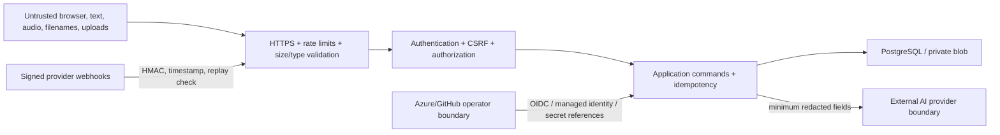

# Security and privacy

## Scope

This document defines the security posture required for the Golden Hour AI prototype and its deployment assets. It is not a certification or proof of production readiness. Real-world use requires a jurisdiction-specific privacy assessment, threat model, penetration test, retention/deletion policy, clinical governance, and operating procedures.

Emergency descriptions, profile facts, audio, location, contact data, tokens, tasks, timelines, and summaries are sensitive. They must remain out of source code, URLs/query strings, analytics, ordinary logs, screenshots, test snapshots, and public issue reports.

## Trust boundaries

Treat browser state, AI output, provider callbacks, filenames, document text, realtime messages, and session IDs as attacker-controlled. A network location, authenticated identity, or model response is not sufficient authorization.

## Data classification

| Class | Examples | Required handling |
| --- | --- | --- |
| Restricted | Auth/refresh/share tokens, signing secrets, provider keys, private documents, raw audio | Never log/cache/client-persist; encrypt in transit/at rest; strict role/resource access; short retention |
| Sensitive emergency | Profile snapshot, allergies/medicines/conditions, observations, location, timeline, summaries | Resource-scoped access; minimal projections; no URL/analytics/snapshot content; audited access |
| Operational metadata | Opaque IDs, status, timestamps, correlation ID, latency/outcome class | Minimize, retain by policy, ensure combinations do not reveal a person |
| Public reviewed content | Product shell, translations, protocol demonstration files | Integrity/version control; safe to PWA-cache; still label prototype/clinical-review status |

No production retention durations are invented here. Define lawful purpose, jurisdiction, retention, deletion, export, backup expiry, legal hold, data residency, and subject-right processes before collecting real data.

## Authentication and browser session

- ASP.NET Core Identity owns password hashing, lockout, normalized identifiers, and role membership.
- Access and refresh credentials are delivered in `Secure`, `HttpOnly`, `SameSite` cookies in shared HTTPS environments; never store JWT or refresh tokens in local/session storage, IndexedDB, Cache Storage, URLs, or JavaScript-readable cookies.
- Access lifetime is short. Refresh tokens are random, stored only as a strong hash, rotated on every use, tied to a token family/device record, and revoked on logout, password/security event, or detected reuse.
- Reuse of an old refresh token revokes its family and produces a security audit event. Responses do not reveal whether a user exists.
- Login/register/refresh/recovery endpoints have per-IP and per-account limits. Lockout messages avoid account enumeration.
- Production signing keys are high entropy and supplied through a secret reference. Issuer, audience, algorithm, expiry, clock skew, and key rotation are explicitly validated.

Cookie-authenticated unsafe methods require CSRF defense: a server-issued antiforgery token bound to the session, custom header, and origin/host validation. SameSite alone is defense-in-depth, not the entire control. CORS is denied by default in the same-origin production topology and never combines wildcard origins with credentials.

## Authorization

Authentication never substitutes for resource authorization. Every profile, session, task, timeline, location, summary, invitation, token, document, and hub operation evaluates the authenticated principal or validated anonymous grant against that exact resource and operation.

Roles (`User`, `Caregiver`, `Emergency participant`, `Administrator`) grant only coarse capability. Session ownership/participation and field-level sharing determine actual access. Administration does not imply routine access to private emergency content.

SignalR connections use the same identity, re-evaluate membership before joining a server-generated group name, and authorize each hub method. Clients cannot provide arbitrary group names or enumerate groups/sessions. Reconnect re-authenticates and refetches state.

## Anonymous bystander links

1. Generate at least 128 bits of randomness with a cryptographic RNG.
2. Return the raw token only once in the URL fragment/path designed for the feature; never write it to logs, analytics, referrers, or server storage.
3. Store only a keyed or memory-hard/cryptographic hash with session, scope, expiry, revocation, and creation metadata.
4. Compare hashes in constant time and return the same response shape for invalid, expired, revoked, or unknown tokens.
5. Rate-limit attempts by token/IP/device signals without locking out the emergency-call action.
6. Project fields through a server allowlist based on the profile snapshot and sharing preference. Insurance, full address, private documents, raw audio, auth tokens, and complete records are excluded by default.
7. Audit access metadata minimally. Anonymous writes are allowlisted, validated, consent-aware, scoped, and idempotent.

Use `Referrer-Policy: no-referrer` and avoid third-party resources on token-bearing pages. The UI provides explicit revoke and expiry state.

## Input and upload security

- Validate every DTO at the boundary and again enforce domain invariants; return RFC 7807 errors with correlation ID and no sensitive values.
- Use parameterized EF queries. Never construct SQL, shell commands, file paths, URLs, HTML, or log templates from untrusted strings.
- React escapes text by default; avoid `dangerouslySetInnerHTML`. Apply a restrictive Content Security Policy and encode any server-rendered value.
- Audio: maximum 30 seconds and a small byte limit, allowlisted MIME/container signatures, filename ignored, generated storage name, malware/content checks where appropriate, bounded decoder/transcriber, and no public blob access.
- Documents (future): reject path traversal, archives/bombs, active content, unsupported extensions/signatures, and prompt instructions. Store outside web root with randomized names and explicit content disposition.
- Normalize/validate Unicode without discarding the original. Protect database/log/UI limits from oversized grapheme sequences and control characters.

## API and state-change controls

- HTTPS only, HSTS outside local development, trusted forwarded-header configuration, secure response headers, and bounded request/body/form/time limits.
- Rate-limit by route risk: strict token/auth/webhook/upload limits and session-aware mutation limits. Return `429` with safe retry information.
- Critical commands carry an opaque idempotency key scoped to actor/resource/operation. Persist the result atomically; a duplicate returns the original result instead of applying twice.
- Use optimistic concurrency/version checks for task/session transitions and return a conflict that prompts a state refetch.
- A transaction commits durable state and outbox entry before realtime/event delivery. Consumers and provider callbacks are idempotent.
- Emergency call initiated/connected and provider delivered states require explicit user/provider evidence; the application never infers success from a button click or queued request.

## Webhook security

Provider-specific endpoints must read a bounded raw body, locate a known provider/secret version, verify an HMAC signature in constant time, validate an absolute timestamp within the configured skew, and atomically reject a previously seen provider event ID/signature digest. Signature verification happens before parsing/trusting fields.

Return quickly after storing a minimal normalized delivery event/outbox job. Do not persist an entire raw payload by default. Invalid signature/timestamp/replay receive an appropriate non-revealing error; valid duplicates return the provider-required idempotent response without replaying state changes.

## AI and external providers

- OpenAI/provider keys are backend-only secrets and never use `VITE_` names.
- Send the minimum redacted fields; provider terms, region, training/retention settings, and data processing agreements require review.
- Treat model output as untrusted structured input and apply the controls in [AI_SAFETY.md](AI_SAFETY.md).
- Provider status is `queued`, `accepted`, `delivered`, `failed`, or `unknown` based only on the provider contract. A local mock is visibly non-production and does not imply external delivery.
- Timeouts, bounded retries, circuit breaking, rate limits, and idempotency prevent hanging or duplicate effects.

## PWA and client storage

The service worker precaches hashed shell assets and reviewed public translations/protocols only. It must not cache authenticated API responses, token-bearing bystander pages, audio, private documents, profile/session responses, or error bodies containing user input. Clear user-scoped local data on logout/revocation.

An opt-in offline card stores only explicitly approved minimal fields, is encrypted where platform capabilities permit, shows its age, and can be removed. Queued updates are limited to noncritical idempotent events; emergency calls, token/sharing operations, invites, and provider notifications are never queued/retried.

## Logging, telemetry, and audit

Use structured allowlisted fields: timestamp, severity, operation name, outcome class, opaque actor/resource ID, correlation/trace ID, duration, dependency name/status, HTTP status, and safe error code. Redact cookies, authorization/signature headers, URLs with tokens, connection strings, keys, emails, phone numbers, location, input/output bodies, filenames, prompt/model text, profile facts, and raw provider payloads.

Audit significant security and state events with UTC time, opaque actor/resource IDs, action, outcome, reason code, and correlation ID. Audit data itself is access-controlled, tamper-evident as operationally feasible, retained by policy, and does not duplicate sensitive content.

Health endpoints expose component status but no secrets, connection details, exception stacks, database names, or private counts. Liveness does not contact dependencies; readiness reports only safe configured/ready/degraded categories.

## Secrets and deployment

- `.env` is local-only and ignored. `.env.example` contains names/placeholders, not usable shared credentials.
- GitHub deployment uses OIDC federation with least-privilege Azure roles; avoid long-lived publish profiles/service-principal passwords.
- GitHub environments require approval for production and contain `POSTGRES_ADMIN_PASSWORD`, `JWT_SIGNING_KEY`, `WEBHOOK_SIGNING_SECRET`, and Android signing secrets where used.
- Azure managed identity is preferred for ACR, Key Vault, Storage, Service Bus, and telemetry. Where an app currently requires a connection string, inject it as a Container App secret and plan migration to identity-based SDK auth.
- No keystore, base64 keystore, `.env`, deployment output, certificate, token, or generated signed artifact is committed.
- Rotate secrets after suspected exposure; refresh/update the Container App revision and revoke old credentials. Do not print secure parameters from scripts.

## Threat register

| Threat | Primary controls | Verification |
| --- | --- | --- |
| Cross-user/profile/session access | Resource authorization and projection | Integration tests using two identities |
| Share token theft/guessing/tampering | Entropy, hash-only store, expiry/revoke, rate limit, no-referrer | Valid/expired/revoked/tampered/guessing tests |
| Refresh replay/session theft | Secure cookies, hash/rotation/family revoke, CSRF | Reuse/logout/CSRF tests |
| XSS/SQL/path traversal | Output encoding/CSP, parameterization, generated storage names | Adversarial boundary tests |
| Webhook forgery/replay | HMAC, timestamp, nonce/event uniqueness, idempotency | Invalid/replayed/duplicate callback tests |
| Prompt injection/unsafe model output | Isolation, strict schema, forbidden checks, deterministic dispatcher/protocol | Direct/document injection and unsafe-output tests |
| Duplicate/concurrent state mutation | Idempotency, optimistic concurrency, unique constraints/transaction | Duplicate and two-writer tests |
| Sensitive telemetry/cache leak | Allowlisted logging, redaction tests, cache inspection | Captured log/cache assertions |
| Dependency outage | Bounded timeout/fallback, server authority, health classifications | AI/DB/blob/bus/SignalR/provider outage tests |
| Supply-chain compromise | Lockfiles, pinned major runtime, dependency review, code scanning, minimal image | CI restore/build/SBOM/scan evidence before release |

## Security verification and reporting

Run the automated negative matrix in [TEST_PLAN.md](TEST_PLAN.md), dependency/secret/container scans, a manual browser storage/cache inspection, cookie/header review, and an authorization matrix before a shared demo. Do not weaken tests to pass a gate.

Report a vulnerability privately to the repository owner with safe reproduction steps and no real medical data. For suspected secret exposure: revoke/rotate first, preserve minimal audit evidence, invalidate affected sessions/share links, assess logs/artifacts/caches, and notify affected parties according to an approved incident process. A production incident contact and disclosure SLA must be defined before launch.
